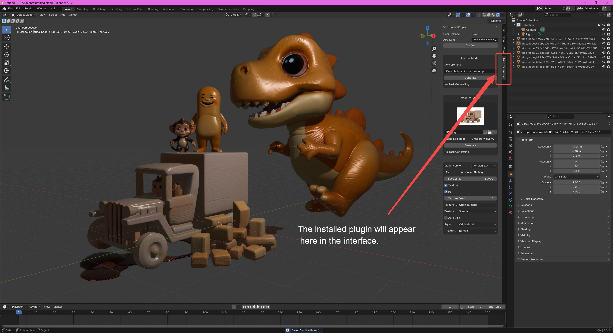

# Tripo 3D Blender Plugin

## Overview

The Tripo 3D Blender Plugin integrates Tripo's AI-powered 3D generation capabilities directly into Blender. Generate high-quality 3D models from text descriptions or images with advanced customization options.

## Features

### Model Generation
- **Text-to-Model**: Create 3D models from text descriptions
- **Image-to-Model**: Convert single images into 3D models
- **Multiview-to-Model**: Generate models from multiple perspective images
- **Real-time Progress Tracking**: Monitor generation progress with a visual progress bar

### Advanced Options
- **Model Versions**: Support for v1.3, v1.4, v2.0, AND v2.5
- **Texture Controls**:
  - Texture quality (standard/detailed)
  - Texture alignment (original image/geometry)
  - Texture seed customization
  - PBR material support
- **Style Options**: Original, Cartoon, Realistic
- **Auto-sizing**: Automatic real-world dimension scaling
- **Face Limit**: Custom polygon count control

## Installation

### Requirements
- Blender 3.0 or higher
- Internet connection
- Valid Tripo API key

### Installation Steps
1. Download the zip file
2. In Blender: Edit > Preferences > Add-ons > Install
3. Select the downloaded file
4. Enable the "Tripo_3D" add-on

After installation, the plugin will appear in the Blender interface as shown below:

## Usage

### Initial Setup
1. Get your API key from [Tripo Platform](https://platform.tripo3d.ai/api-keys)
2. Enter your API key in the plugin panel
3. Click "Confirm" to validate and check your balance

### Text to 3D
1. Enter your text prompt
2. Select model version (v1.0 or v2.0-20240919)
3. Configure advanced settings (optional):
   - Texture quality
   - PBR materials
   - Face limit
   - Style options
4. Click "Generate"

### Image to 3D
1. Choose between single image or multiview mode
2. Upload image(s):
   - Single mode: One reference image
   - Multiview mode: Front, left, and back views
3. Configure model settings
4. Click "Generate"

### Supported File Types
- JPG/JPEG
- PNG
- WebP
- Maximum file size: 10MB

## Error Handling
The plugin includes comprehensive error handling for:
- Network connectivity issues
- API authentication
- File validation
- Generation process monitoring

## Technical Details

### API Integration
- Automatic retry mechanism with exponential backoff
- Efficient resource management
- Progress tracking and status updates
- Temporary file cleanup

### Performance Features
- Asynchronous task processing
- Efficient UI updates
- File caching
- Memory management

## Support and Documentation

- [Tripo API Documentation](https://platform.tripo3d.ai/docs/introduction)
- [API Status Page](https://platform.tripo3d.ai/status)
- Email Support: support@tripo3d.ai

## License

This plugin is distributed under the terms of the MIT license - see the LICENSE file for details.

## Acknowledgments

- [Tripo 3D](https://tripo3d.ai) for the 3D generation API
- [Poly Haven](https://polyhaven.com) for the 3D assets
- [blender-mcp](https://github.com/ahujasid/blender-mcp) by [Siddharth Ahuja](https://github.com/ahujasid)
- Special thanks to our Discord channel member **Zeak6464** for his significant contributions to the plugin code and for assisting in the testing channel. Your support has been invaluable!
- Special thanks to **Siddharth Ahuja** for the blender-mcp project, which provided inspiring ideas for MCP + 3D.

## Version History

- **0.7.0**: New Features
  - Display task information including input details and rendered images
  - Support for concurrent generation of multiple models

- **0.6.0**: Quality-of-Life Improvements
  - Fixed URL query issues for more reliable API communication
  - Improved imported model orientation (models now face +Y direction by default)
  - Added support for using Blender internal images without external file loading
  - Fixed an issue where models could be lost when not in Object mode during import
  - Changed rotation mode from quaternion to Euler for more intuitive manipulation

- **0.5.0**: Advanced Features  
  - Added more stable v2.5 model generation support  
  - Introduced support for generating quadrilateral models  
  - Added a new model management window to record all user-initiated generation tasks  
  - Users can now download tasks multiple times through the management window  
  - Implemented a search feature based on task ID to find and add previously initiated tasks  
  - Effectively prevented balance loss caused by network connection issues during ongoing tasks  

- **0.4.0**: Model Generation Support  
  - Introduced support for v2.5 model generation for the first time  

- **0.3.0**: Stability Enhancements  
  - Enhanced plugin stability  
  - Provided more stable model import functionality  

- **0.2.0**: Update  
  - Fixed installation issue that prevented installation from a compressed package  
  - Resolved model import issues  
  - Added support for generating three views (front, side, and top)  
  - Introduced a reverse prompting feature for text generation models  
  - Added options for character pose and body proportion control  

- **0.1.0**: Initial release  
  - Basic text-to-3D and image-to-3D functionality  
  - Support for v1.0 and v2.0-20240919 models  
  - Advanced texture and style controls  
